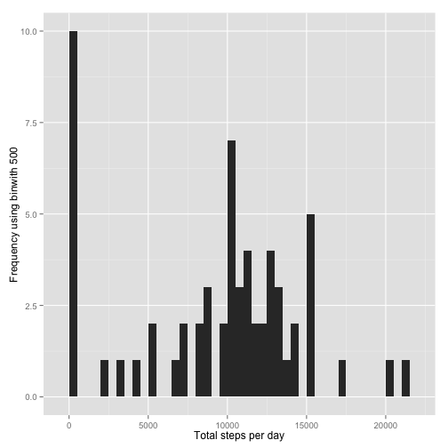
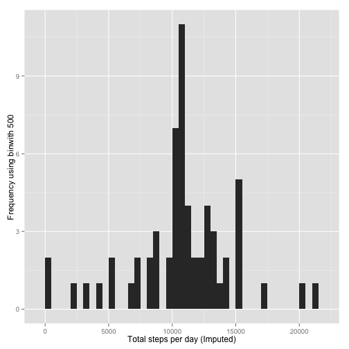
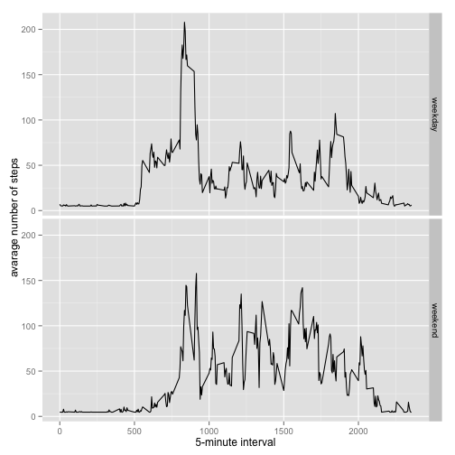

# Reproducible Research: Peer Assessment 1

```{r, echo=FALSE, results='hide', warning=FALSE, message=FALSE}
library(ggplot2)
library(scales)
library(Hmisc)
```

## Loading and preprocessing of  data
##### 1.Load the data (i.e. `read.csv()`)
```{r, results='markup', warning=TRUE, message=TRUE}
if(!file.exists('activity.csv')){
    unzip('activity.zip')
}
activity <- read.csv('activity.csv')
```
##### 2. Process/transform the data (if necessary) into a format suitable for your analysis
```{r}
#activity$interval <- strptime(gsub("([0-9]{1,2})([0-9]{2})", "\\1:\\2", activity$interval), format='%H:%M')
```

-----

## What is mean total number of steps taken per day?
```{r}
stepstakenbyday <- tapply(activity$steps, activity$date, sum, na.rm=TRUE)
```

##### 1. Make a histogram of the total number of steps taken each day
```{r}
qplot(stepstakenbyday, xlab='Total steps taken per day', ylab='Frequency', binwidth=500)
```
 

##### 2. Calculate and report the mean and median total number of steps taken per day
```{r}
stepstakenbydayMean <- mean(stepstakenbyday)
stepstakenbydayMedian <- median(stepstakenbyday)
```
* Mean = 9354.2295
* Median =  10395

-----

## What is the average daily activity pattern?
```{r}
averagedailypattern <- aggregate(x=list(meanSteps=activity$steps), by=list(interval=activity$interval), FUN=mean, na.rm=TRUE)
```

##### 1. Make a time series plot
```{r}
ggplot(data=averagedailypattern, aes(x=interval, y=meanSteps)) +
    geom_line() +
    xlab("5-minute interval") +
    ylab("Average number of steps taken") 
```

 

##### 2. Which 5-minute interval, on average across all the days in the dataset, contains the maximum number of steps?
```{r}
mostSteps <- which.max(averagedailypattern$meanSteps)
timeMostSteps <-  gsub("([0-9]{1,2})([0-9]{2})", "\\1:\\2", averagedailypattern[mostSteps,'interval'])
```

* Most Steps at = 8:35

----

## Imputing missing values
##### 1. Calculate and report the total number of missing values in the dataset 
```{r}
numbermissingvalues <- length(which(is.na(activity$steps)))
```

* Number of missing values = 2304

##### 2. Devise a strategy for filling in all of the missing values in the dataset.
##### 3. Create a new dataset that is equal to the original dataset but with the missing data filled in.
```{r}
activityImputed <- activity
activityImputed$steps <- impute(activity$steps, fun=mean)
```


##### 4. Make a histogram of the total number of steps taken each day 
```{r}
totalstepsbydayImputed <- tapply(activityImputed$steps, activityImputed$date, sum)
qplot(totalstepsbydayImputed, xlab='Total steps per day (Imputed)', ylab='Frequency', binwidth=500)
```
 

##### ... and Calculate and report the mean and median total number of steps taken per day. 
```{r}
totalstepsbydayImputed <- mean(totalstepsbydayImputed)
totalstepsbydayImputedMedianImputed <- median(totalstepsbydayImputed)
```
* Mean (Imputed) = 1.076618910^{4}
* Median (Imputed) = 1.076618910^{4}

Mean (Imputed) = 1.076618910^{4}
Median (Imputed) = 1.076618910^{4}
----

## Are there differences in activity patterns between weekdays and weekends?
##### 1. Create a new factor variable in the dataset with two levels -- "weekday" and "weekend" indicating whether a given date is a weekday or weekend day.

```{r}
activityImputed$dateType <-  ifelse(as.POSIXlt(activityImputed$date)$wday %in% c(0,6), 'weekend', 'weekday')
```

##### 2. Make a panel plot containing a time series plot

```{r}
averagedActivityImputed <- aggregate(steps ~ interval + dateType, data=activityImputed, mean)
ggplot(averagedActivityImputed, aes(interval, steps)) + 
    geom_line() + 
    facet_grid(dateType ~ .) +
    xlab("5-minute interval") + 
    ylab("Average number of steps taken")
```
 

* Yes their seems to be a difference in activity patterns between weekdays and weekends.
